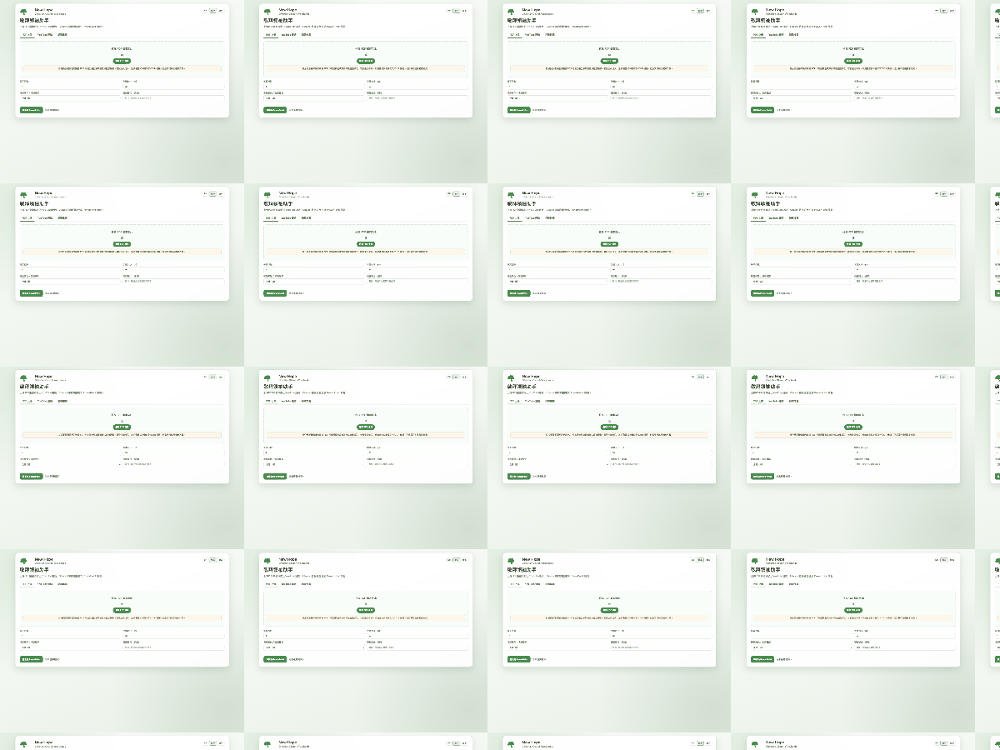
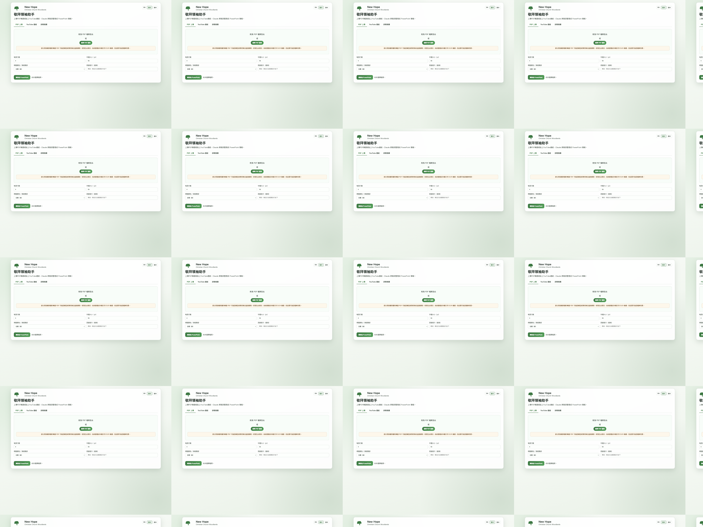
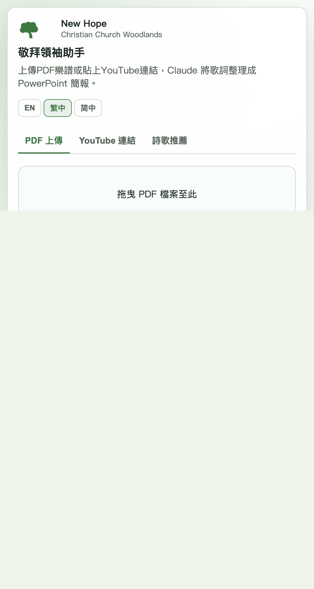
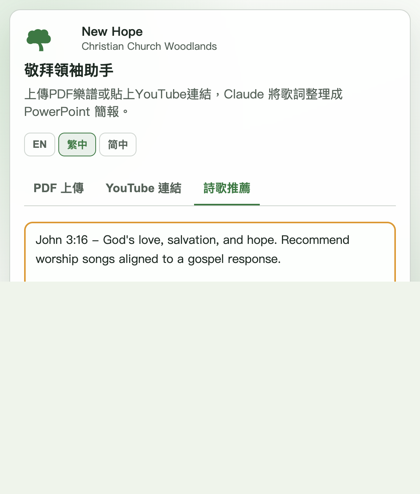

# Worship Leader Assistant

Worship Leader Assistant helps worship teams quickly prepare service materials from real ministry inputs:

- PDF worship sheets -> formatted lyric slides (PPTX)
- YouTube links -> transcript/description -> formatted lyric slides (PPTX)
- Sermon theme / Bible passage -> ranked song recommendations from your church song database

The output format follows your church slide style guide so the deck is usable immediately with minimal cleanup.

## Quick Demo GIF



## Screenshot Tour

### 1) Home + PDF workflow



### 2) YouTube workflow



### 3) Song recommender workflow



## Features

### PDF -> PPTX (lyrics slides)

- Upload one or multiple PDF files.
- Detects and removes likely chord-only/music-notation lines.
- Removes common metadata (copyright lines, CCLI notes, etc.).
- Attempts section grouping (Verse/Chorus/Bridge...).
- Uses local fallback extraction when model extraction fails:
	- text-layer parsing
	- OCR fallback (Tesseract) for scanned PDFs
- Generates either:
	- one PPTX for one PDF, or
	- one combined PPTX for multiple PDFs

### YouTube -> PPTX

- Accepts one or multiple YouTube URLs (one per line).
- Supports extraction source modes:
	- transcript/captions
	- description text
	- auto fallback (backend-supported)
- Structures lyrics into worship sections and outputs one formatted PPTX.

### Song Recommender

- Input sermon notes, message summary, or Bible passage.
- Ranks relevant worship songs from `songs_database.xlsx`.
- Returns reasoned recommendations with optional song links.

### Church style defaults (slide output)

- Background: `#1A1A1A`
- Lyrics text: `#F5F5F5`
- Title + slide counter color by vocal part:
	- male: blue
	- female: red
	- everyone: green
- Optional red footer note shown on first slide of each song

## Tech Stack

- Backend: FastAPI
- Frontend: HTML/CSS/Vanilla JavaScript
- LLM: Anthropic Claude (for extraction/structuring/recommendation)
- PPTX generation: python-pptx
- PDF processing: PyMuPDF
- OCR fallback: pytesseract + Tesseract
- YouTube extraction: youtube-transcript-api + yt-dlp
- Song database parsing: pandas + openpyxl

## Repository Structure

```text
.
├── app/
│   ├── main.py                 # FastAPI app, APIs, extraction and PPTX logic
│   └── static/
│       ├── index.html          # Web UI
│       └── church-logo.svg
├── docs/
│   └── screenshots/            # README screenshots
├── scripts/
│   ├── regression_pdf.py       # Regression check for PDF conversion
│   └── regression_youtube.py   # Regression check for YouTube conversion
├── samples/
├── requirements.txt
├── Procfile
└── railway.toml
```

## Quick Start (Local)

### 1) Prerequisites

- Python 3.9+
- macOS/Linux/Windows
- Tesseract binary for OCR fallback (recommended)

### 2) Install dependencies

```bash
python -m venv .venv
source .venv/bin/activate
pip install -r requirements.txt
```

If you are using conda, that is also supported.

### 3) Configure environment variables

Create a `.env` file in project root:

```bash
ANTHROPIC_API_KEY=your_anthropic_api_key

# Optional for yt-dlp scenarios that require cookies:
# YTDLP_COOKIE_FILE=/absolute/path/to/cookies.txt
# YTDLP_COOKIES_FROM_BROWSER=chrome
```

Notes:

- `ANTHROPIC_API_KEY` is required for model-based extraction/recommendation.
- `YTDLP_COOKIES_FROM_BROWSER` is opt-in only.

### 4) Install Tesseract (recommended)

macOS:

```bash
brew install tesseract
```

Ubuntu/Debian:

```bash
sudo apt-get update
sudo apt-get install -y tesseract-ocr
```

### 5) Run the app

```bash
uvicorn app.main:app --host 127.0.0.1 --port 8000 --reload
```

Open:

- http://127.0.0.1:8000

## How To Use

### A) Convert PDF worship sheets

1. Open the `PDF Upload` tab.
2. Drag/drop PDFs or click `Choose PDF files`.
3. Set:
	 - lines per slide
	 - font size
	 - vocal part (title color)
	 - optional footer note
4. Click `Convert to PowerPoint`.
5. Download starts automatically.

### B) Convert YouTube songs

1. Open the `YouTube URL` tab.
2. Paste one URL per line.
3. Choose source mode (Transcript or Description).
4. Set formatting options.
5. Click `Convert to PowerPoint`.

### C) Get song recommendations

1. Open the `Song Recommender` tab.
2. Paste sermon text, service theme, or Bible passage.
3. Choose number of songs (1-15).
4. Click `Find Songs`.
5. Review ranked songs with reasons.

## API Endpoints

### `GET /`

Serves the web UI.

### `POST /api/convert`

Convert one or more uploaded PDFs to styled lyric PPTX.

Form fields:

- `files` (required, multiple PDF files)
- `lines_per_slide` (default `4`, range `2-12`)
- `font_size` (default `56`, range `20-72`)
- `vocal_part` (`male|female|everyone`)
- `footer_note` (optional)

Response:

- `application/vnd.openxmlformats-officedocument.presentationml.presentation`
- Header: `X-PDF-Fallback-Used: true|false`

### `POST /api/convert-youtube`

Convert one or more YouTube URLs into styled lyric PPTX.

Form fields:

- `urls` (required, one URL per line)
- `source` (`transcript|description|auto`)
- `lines_per_slide`
- `font_size`
- `vocal_part`
- `footer_note`

### `POST /api/recommend-songs`

Recommend songs from local database.

JSON body:

```json
{
	"message": "John 3:16 ...",
	"count": 7
}
```

## Regression Scripts

Run regression checks:

```bash
python scripts/regression_pdf.py
python scripts/regression_youtube.py
```

Example with custom arguments:

```bash
python scripts/regression_pdf.py --input "samples/your_song.pdf" --output "samples/out.pptx"
python scripts/regression_youtube.py --url "https://youtu.be/VIDEO_ID" --source transcript
```

Scripts print `PASS/FAIL` plus key metadata and basic style checks.

## Deploy

### Railway

This repo includes `railway.toml` and starts via:

```bash
uvicorn app.main:app --host 0.0.0.0 --port $PORT
```

### Procfile platforms

`Procfile` is included for process-based deployment targets.

## Troubleshooting

### 1) `Could not load song database`

- Ensure `songs_database.xlsx` exists in project root.
- Ensure `pandas` and `openpyxl` are installed.

### 2) PDF conversion fails for scanned scores

- Install Tesseract.
- Ensure `pytesseract` is installed (`pip install pytesseract`).
- Retry with clearer scans if OCR quality is low.

### 3) Provider content filter blocks direct score extraction

- The app automatically attempts local fallback extraction.
- If output is still poor, try a lyric-only PDF source.

### 4) YouTube extraction fails

- Try switching Transcript <-> Description mode.
- Some videos require cookies; set one of:
	- `YTDLP_COOKIE_FILE`
	- `YTDLP_COOKIES_FROM_BROWSER`

## Security and Data Notes

- Do not commit API keys.
- Keep `.env` local and gitignored.
- Review copyright and usage rights for lyric/sheet sources used in ministry workflows.

## License

Add your preferred license (MIT/Apache-2.0/etc.) if this repo will be shared publicly.